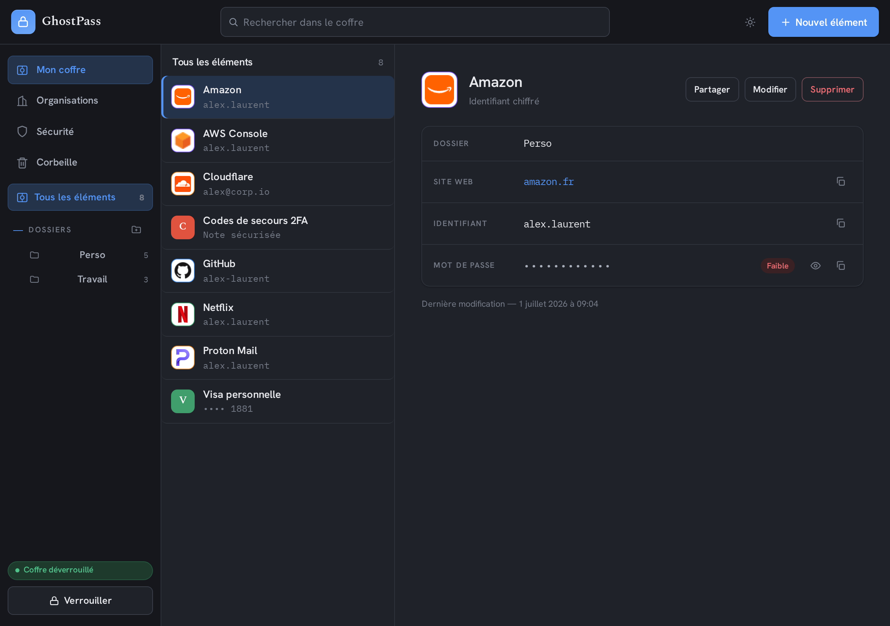
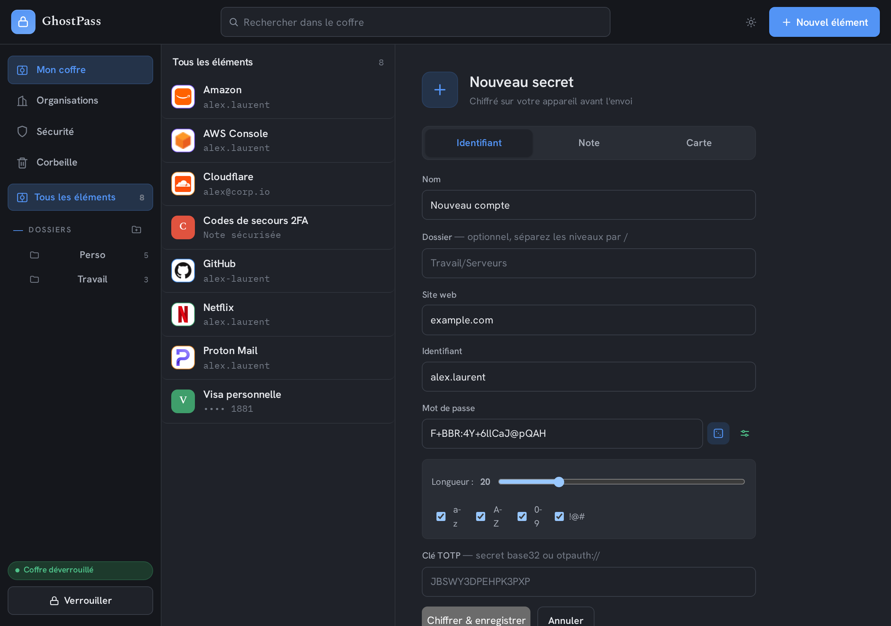
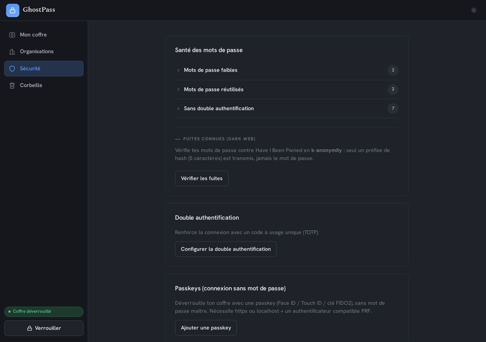
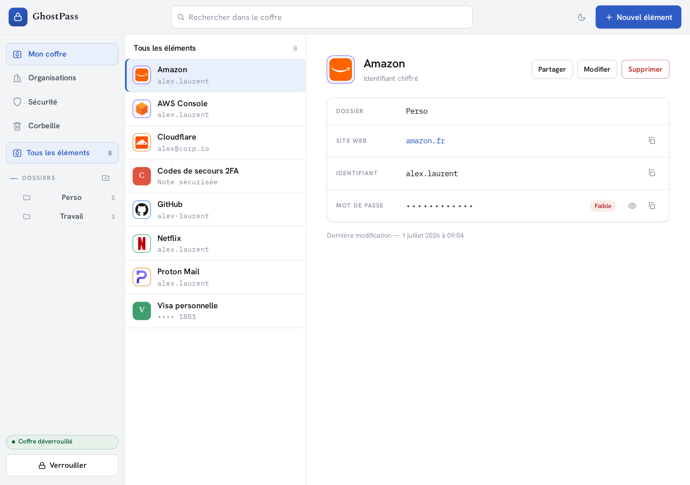

<h1 align="center">GhostPass 👻</h1>

<p align="center">
  <strong>Zero-knowledge</strong> password manager for humans and teams.<br>
  The server only ever stores encrypted blobs it can <strong>never</strong> read —
  all encryption happens client-side.
</p>

<p align="center">
  Part of the <strong>ghost suite</strong> · eventually a <strong>Secrets Manager</strong>
  tier (HashiCorp Vault-style) for machines.
</p>

<p align="center">
  
  
  
  
  
</p>

---

## Screenshots

<p align="center">
  
</p>

<p align="center">
  <em>The vault: everything is decrypted locally, the server only sees blobs. Folders, self-hosted favicons, strength indicator.</em>
</p>

<table>
  <tr>
    <td width="50%"></td>
    <td width="50%"></td>
  </tr>
  <tr>
    <td align="center"><em>Generator — encrypted on-device before upload</em></td>
    <td align="center"><em>Password Health · breaches (HIBP k-anonymity) · TOTP · passkeys</em></td>
  </tr>
</table>

<p align="center">
  
</p>

<p align="center"><em>Light theme available too.</em></p>

---

## Features

- **Zero-knowledge / E2E** — the master password never leaves the device; the server only sees ciphertext.
- **Vault** — logins, **secure notes**, **cards**, **folder** tree, edit/delete, **trash** (soft-delete + restore), per-item password **history**.
- **Generator** — password generator (length / character sets, CSPRNG randomness).
- **Password Health** — weak, reused, and 2FA-less passwords (computed 100% locally).
- **Dark-web monitoring** — breach checks via HIBP using **k-anonymity** (only a hash prefix is sent).
- **Built-in TOTP** — one-time codes with a timer, right in the vault.
- **Organizations** — collections, roles, authenticated Org Key distribution, **revocation via key rotation**.
- **Ephemeral sharing (Send)** — client-side encrypted link, key in the URL fragment, expiry + one-time use.
- **Account recovery** — recovery kit; **emergency access** (sealed USK for a contact, server-gated delay).
- **Passkeys** — FIDO2/WebAuthn 2FA and **passwordless** login via PRF (the vault key is wrapped by the PRF secret).
- **Import / export** — CSV plus 1Password / Bitwarden / Proton formats.
- **Light / dark theme**.

## How it works

The master password is run through **Argon2id** client-side to derive (a) an *authentication hash* sent to
the server — which **re-hashes it with scrypt + salt** before storage and therefore can't recover the master
password — and (b) a **user key (USK)** that never leaves the device. Items are encrypted with
**XChaCha20-Poly1305** under that key; sharing between organization members relies on **X25519**. The crypto
core is a **Rust module compiled to WASM**: plaintext keys live inside the WASM and are never exposed to
JavaScript.

```
Master password ──Argon2id──▶ auth hash ──▶ server (re-hash scrypt + salt)
                └─────────────▶ user key (USK) ──▶ stays on device
                                                 └─ encrypts items (XChaCha20-Poly1305)
```

## Structure (monorepo)

| Path | Role |
|---|---|
| `crates/ghostpass-crypto` | Rust crypto core: Argon2id, XChaCha20-Poly1305, X25519, items, org, recovery |
| `crates/ghostpass-crypto-wasm` | WASM binding of the core (web + extension) |
| `apps/server` | Fastify backend (auth, vault, TOTP MFA, recovery) |
| `apps/web` | Svelte SPA web app (vault, client-side zero-knowledge) |
| `ARCHITECTURE.md` | Living architecture plan (decisions, roadmap, threat model) |
| `docs/ROADMAP.md` | Prioritized product backlog + competitive analysis |

> The **browser extension** (Manifest V3, autofill) lives in a dedicated repo: `ghostpass-extension`.

## Getting started

Prerequisites: Rust toolchain + `wasm-pack`, Node.js. The WASM core must be built before the web app.

```bash
# 1. Crypto core → WASM (artifact for web + extension)
cd crates/ghostpass-crypto-wasm && wasm-pack build --target web

# 2. Fastify backend (port 3000, SQLite in dev — nothing to run)
cd apps/server && npm install && npm run dev

# 3. Web app (port 5173, /api proxied to the backend)
cd apps/web && npm install && npm run dev
```

> ⚠️ **Dev machine behind a proxy**: crates.io / npm are reached directly — prefix `cargo`/`npm`
> commands with an extended `no_proxy` (see `crates/ghostpass-crypto/README.md`).

## Tests

```bash
cd crates/ghostpass-crypto && cargo test          # crypto core (21 tests)
cd apps/server && npm test                         # backend, node:test (22 tests + 2 e2e)
cd apps/web && npm run check                        # svelte-check (typing)
```

The full flow (WASM crypto + backend + decryption) is also verified end-to-end by
`apps/server/scripts/e2e.ts`.

## Architecture & security

- **Architecture** — layers, data flows and threat model in [`ARCHITECTURE.md`](ARCHITECTURE.md).
- **Security** — scope, guarantees and disclosure in [`SECURITY.md`](SECURITY.md). An **internal audit**
  (2026-06-19) found no critical findings; High/Medium fixes have been applied. External audit / pentest to come.
- **Isolated, auditable crypto core** (Rust), reused identically by the web app and the extension via WASM.

## Roadmap

Prioritized backlog and competitive comparison in [`docs/ROADMAP.md`](docs/ROADMAP.md). Next major product
milestone: the **browser extension** (autofill), then enterprise features (SSO/SCIM) and the **Secrets
Manager** tier for machines.

## License

[MIT](LICENSE) © StackOps HQ
