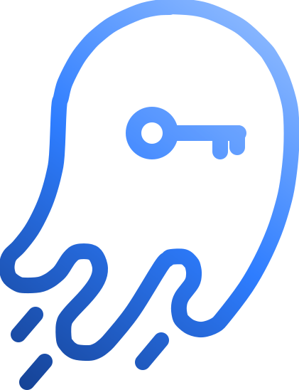

<p align="center">
  
</p>

<h1 align="center">GhostPass</h1>

<p align="center">
  <strong>A password manager whose server cannot read your passwords.</strong><br>
  Not "does not". <em>Cannot</em> — there is no decryption code on the server side,
  and you can check that yourself in about a minute.
</p>

<p align="center">
  <a href="https://git.stackops.ch/stackops/ghostpass/actions"></a>
  
  
  
  
  <a href="LICENSE"></a>
</p>

---

<p align="center">
  
</p>

## The one-minute proof

Most zero-knowledge claims are a paragraph in a marketing page. Here is ours as
a command you can run:

```bash
grep -rni "chacha" apps/server/src | wc -l
# 0
```

XChaCha20-Poly1305 is the cipher that seals a vault, and it exists **only** in
the Rust core — which runs in your browser, compiled to WebAssembly. Your master
password is turned into a key on your device, and that key never crosses the
network.

**The server does hold one decryption primitive, and we would rather name it
than let you find it.** `services/secretAtRest.ts` reads the second-factor seed
back with AES-256-GCM, because checking a six-digit code requires that seed. It
opens nothing else: no vault, no note, no card.

*Until 2026-08-31 this section printed a wider command and claimed it returned
`0`. It returned `5` — the AES above, plus the word in three comments. A proof
you invite people to run has to survive being run.*

**The counterpart, and we would rather you read it here than discover it:** if
you lose your master password and your recovery kit, **your data is gone**. We
cannot reset it. That is the same property, seen from the other side.

## What it does

**Vault** — logins, secure notes, cards, a folder tree, trash with restore, and
per-item password history.

**Teams** — organisations, collections, roles, authenticated Org Key
distribution, and revocation by key rotation rather than by a flag in a database.

**Passkeys** — FIDO2/WebAuthn as a second factor, and **passwordless login** via
the PRF extension: the authenticator derives a stable secret that wraps your
vault key, client-side. It is the only construction that gives passwordless
sign-in *without* handing the server something that decrypts.

**Health and monitoring** — weak, reused and 2FA-less passwords, computed
entirely locally. Breach checks through HIBP using k-anonymity: only a hash
prefix leaves your browser.

**Ephemeral sharing** — a client-side encrypted link whose key lives in the URL
fragment, with expiry and one-time use. The receiving host is verified before
decryption, because a fragment is invisible to the network but not to the page
that reads it.

**And the boring, necessary parts**: built-in TOTP, import from 1Password,
Bitwarden and Proton, full data export, and account deletion — both in the
interface, without writing to anyone.

## How the crypto fits together

```
Master password ──Argon2id──▶ auth hash ──▶ server (re-hashed, scrypt + salt)
                └────────────▶ user key ──▶ never leaves the device
                                          └─ encrypts items (XChaCha20-Poly1305)
                                             shares between members (X25519)
```

Plaintext keys live inside the WebAssembly module and are never handed to
JavaScript. The same Rust core is used, byte for byte, by the web app and the
browser extension — so a review of the core covers both.

## Run your own

The whole product self-hosts, and that is not a footnote. If you would rather
not trust our infrastructure — or the CDN that serves our JavaScript — you serve
it yourself, and the trusted party becomes you.

```bash
git clone https://github.com/stackopshq/ghostpass.git
cd ghostpass
cp .env.example .env      # one secret to fill: POSTGRES_PASSWORD
podman compose -f compose.selfhost.yml up -d
```

Then open `http://localhost:8080`. The first account you create is yours.

`docker-compose.yml` at the root is a **development** stack — it mounts the
sources and does not serve the web app. `compose.selfhost.yml` is the one that
runs the published images.

Images are published for every commit on `main`:

```
ghcr.io/stackopshq/ghostpass:sha-<commit>        # API
ghcr.io/stackopshq/ghostpass:sha-<commit>-web    # static web app behind nginx
```

Pin a digest rather than a moving tag. We do, on our own deployment.

## Develop

You need a Rust toolchain with `wasm-pack`, and Node.js. **The WASM core must be
built before the web app** — it is a `file:` dependency, and a fresh clone
without it fails with type errors that look unrelated.

```bash
cd crates/ghostpass-crypto-wasm && wasm-pack build --target web
cd apps/server   && npm install && npm run dev   # :3000, SQLite in dev
cd apps/web-next && npm install && npm run dev   # :5173, /api proxied
```

```bash
cd crates/ghostpass-crypto && cargo test   # crypto core
cd apps/server && npm test                 # 123 tests
cd apps/web-next && npx tsc --noEmit       # types
```

## Layout

| Path | Role |
|---|---|
| `crates/ghostpass-crypto` | The Rust core: Argon2id, XChaCha20-Poly1305, X25519, items, org, recovery |
| `crates/ghostpass-crypto-wasm` | Its WASM binding, shared by the web app and the extension |
| `apps/server` | Fastify API — auth, vault, MFA, organisations, sharing |
| `apps/web-next` | The web app (Next, static export, served by nginx) |
| `docs/legal/` | Data processing agreement and terms |
| [`ARCHITECTURE.md`](ARCHITECTURE.md) | Layers, data flows, threat model |
| [`SECURITY.md`](SECURITY.md) | Guarantees, scope, and what is *not* covered |

The **browser extension** (Manifest V3, autofill) lives in `ghostpass-extension`.

## Security

Report a vulnerability to **contact@stackops.ch** — see
[`/.well-known/security.txt`](apps/web-next/public/.well-known/security.txt).
We acknowledge within 72 hours, keep you posted, and credit you if you want.

**What we publish about ourselves.** Two external-style audits were run on
2026-08-30 — a data-protection one and a mock ISO 27001 one — and their findings
are being worked through in the open. Two of them were real leaks on the live
instance, and both are closed: the log recorded the domain of every vault entry,
and the favicon cache let one client infer another's vault by response time.

Two known gaps remain, and they are written in our
[DPA](docs/legal/dpa.md) rather than left out: the TOTP secret is stored
unencrypted at rest, and internal database connections are not yet TLS. We would
rather you learn that here than from someone else.

## Contributing

Issues and pull requests are welcome. `main` is protected: every change goes
through a pull request with the checks green — including on us.

Two things worth knowing before you write code:

- **The source of truth is `git.stackops.ch/stackops/ghostpass`.** GitHub is a
  mirror, force-pushed every eight hours. A pull request merged on GitHub will
  be silently overwritten — open it on the forge.
- **Comments explain *why*, not *what*.** The codebase is written for whoever
  reads it in two years, which usually means recording the measurement or the
  incident that produced a decision. When you change a value, check the comment
  above it is still true — a stale justification costs more than a wrong value,
  because it discourages reopening the question.

## Licence

[MIT](LICENSE) © StackOps
